来自于Google IO'2022 VPS and the ARCore Geospatial API  

[[youtube]](https://www.youtube.com/watch?v=pFn11hYZM2E) [[bilibili]](https://www.bilibili.com/video/BV1hY4y137Dn/)

---

[TOC]

# 三维机器模型

在过去 15 年中，我们一直在使用卫星空中和地面图像以完美的细节和规模绘制世界地图，以建立前所未有的理解。在整个动态物理世界中，我们已经覆盖了超过**1000万英里的街景**，距离可以环绕地球 400 多圈。
我们还覆盖了超过**3600 万平方英里的高清卫星图像**，覆盖了超过 98% 的全球人口。

利用这个庞大的数十亿图像语料库，我们将它们融合在一起形成一个3D世界模型，该模型在几何和语义上都可以理解世界，是基础为我们的第一方应用程序（如谷歌地图和地球）奠定了基础。
这个3D世界模型针**对可视化(visualization)**，**分析(analysis)**和**定位(localization)**行了优化，换句话说，地图适用于人类和机器。

今天我们在这里与您讨论**机器可读的3D模型**，尤其是您口袋里的智能手机摄像头，以及我们如何利用 Google 对世界的理解来丰富它，让开发者社区能够创建身临其境的世界级增强现实体验。

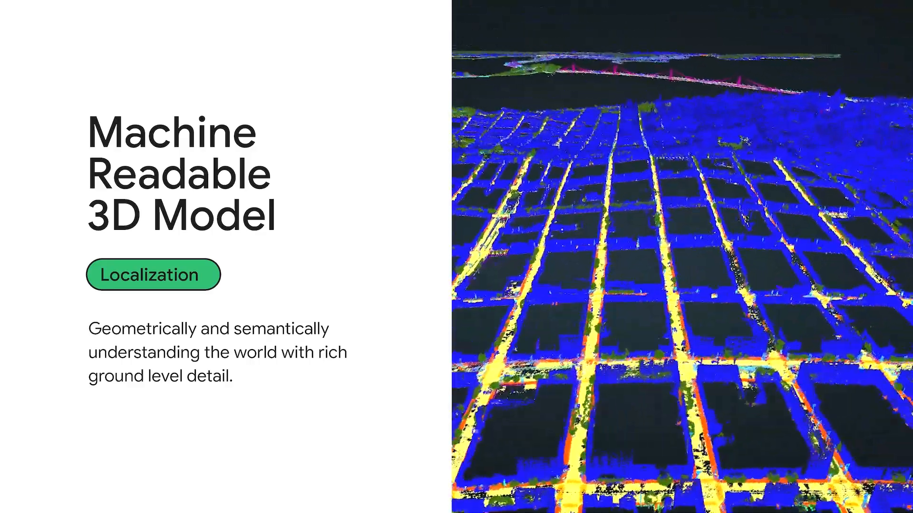
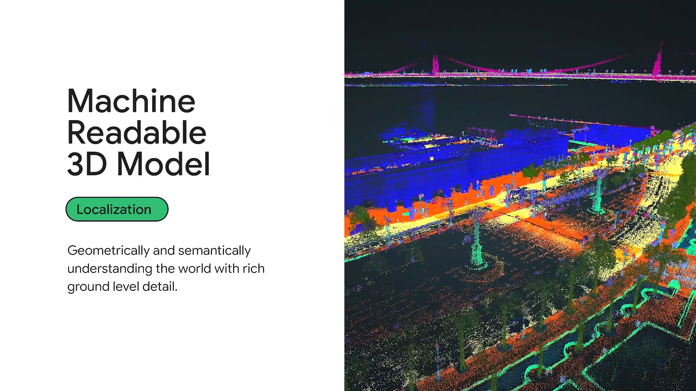

我们很高兴与 Google AR 团队合作，通过 Google 的 AR 开发者平台 ARCore 将这种对世界的 3D 理解带给您，该平台允许 Android 和 iOS 开发者为移动设备构建身临其境的 AR 体验。

# 全球定位

这项技术被称为**全球定位(Global Localization)**，并已在生产中进行了压力测试，为 Google Maps 中的 AR Live View 模式和 Google Lens 中的 AR Places Filter 提供支持。

今天我们很高兴向我们的阿开发者社区开放相同的核心功能，让您可以在您自己的应用程序中创建沉浸式基于位置的AR体验。**此功能在全球超过93个国家可用，只需要有街景图象。**

介绍完这个背景，让我们直入主题吧。

我们将首先讨论构建基于位置的 AR 体验的不同选项；然后，我们将提供有关我们路线图的技术能力的背景，并引导您了解使用此 API 的基础知识以及入门的难易程度；最后，我们将分享我们的早期合作伙伴已经在使用地理空间 API 解决一系列垂直和用例方面所做的事情。

## 不同定位方案

如果您想在今天构建基于位置的 AR 体验，您有几个选择:

- 使用手机上的 GPS 和指南针等内置传感器。
- 使用 ARCore Cloud Anchors API 等空间锚点。
- 使用今天讨论的主题 Geospatial API。

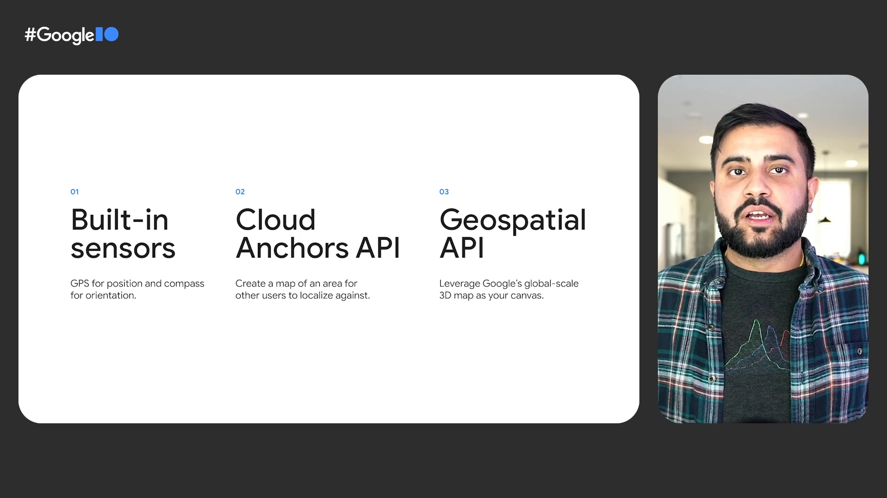
让我们了解使用这些不同选项的好处和权衡。

你有 GPS，这是一个全球规模的系统，非常适合构建基于位置的体验。但是，如果您曾经处理过您的蓝色跳跃问题，尤其是在城市峡谷中，您就会知道准确度与您构建可靠地增强相机视图的 AR 体验所需的精度相去甚远。即使在您使用“定位服务”校准指南针时使用了疯狂的八模式，您通常也会获得 5 到 10 米的定位精度和 30 到 45 度的旋转精度。这意味着您的相机甚至可能没有朝正确的方向看，或者您的 AR 元素完全超出框架。

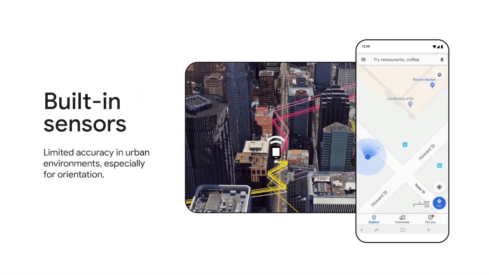

您还可以使用 ARCore Cloud Anchors 等空间锚定功能。在这种情况下，您需要明确映射空间或感兴趣的地方以将内容附加到它，然后可以可靠地对其进行定位。Cloud Anchors 在近距离、私人空间或较小的活动规模体验中非常有效，您可以在这些体验中实际显示并在附加 AR 内容之前映射空间。但随着云锚点的大规模部署，发现内容是一项挑战，放置也是如此。

我们从开发者社区获悉，您希望将用户引导到正确的位置，以便能够远程放置内容而无需亲自前往这些位置，而这两者在今天的云锚点上都很难做到。

进入视觉定位系统和全球定位。

多亏了谷歌十多年的地面图像，我们已经完美地绘制了世界地图。通过与定位服务一起工作，我们可以进行良好的 GPS 估计并使其变得更好，为 AR 做好准备。因此，借助 ARCore Geospatial API，您可以远程将内容附加到世界并引导用户访问，从而让您几乎可以在我们拥有街景的任何地方创建身临其境的基于位置的 AR 体验。

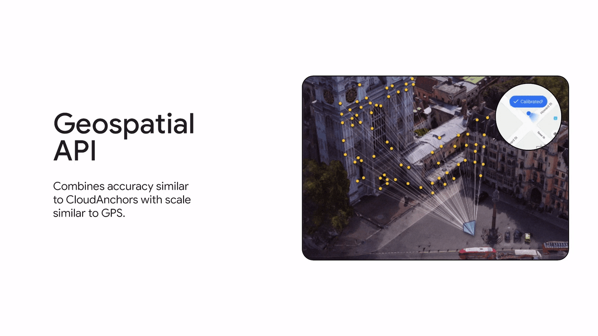

让我们总结一下差异。

- 使用 GPS，您可以在全球范围内获得较低的精度和可变的可靠性。
- 使用 Cloud Anchors API，您可以在有限的范围内获得高精度，因为您明确需要映射空间。
- 借助 Geospatial API，您可以两全其美，在世界上远程放置内容并提供几乎无处不在、准确的定位和航向，而无需手动映射空间。

我们希望随着时间的推移展现更多功能，以帮助您构建真正的下一代体验。

我现在将把它交给 Simon 来解开支持 Geospatial API 的底层技术以及它为您提供的将世界变成画布的功能。

SIMON LYNEN： 谢谢，比拉瓦尔。

在接下来的几分钟内，我将向您介绍地理空间 API 的三个支柱。

- 地理定位
- 几何和锚定
- 世界理解。

## 视觉定位
定位是地理空间 API 的基础。通过允许您将虚拟内容与全球相关联，将您的 AR 体验带入全球范围是关键。

为提供此功能，该设备向视觉定位服务 VPS 发起服务器调用，**您的地理坐标和图像用于匹配来自 Google 地图的高分辨率 3D 数据**。这个过程称为**视觉定位(Visual Localization)**。它可以比以前单独使用 GPS 更准确地定位您的设备相对于环境的位置。我想花点时间了解一下这一切是如何运作的。

街景图像——已在全球范围内拍摄超过 15 年——是 VPS 的基础。
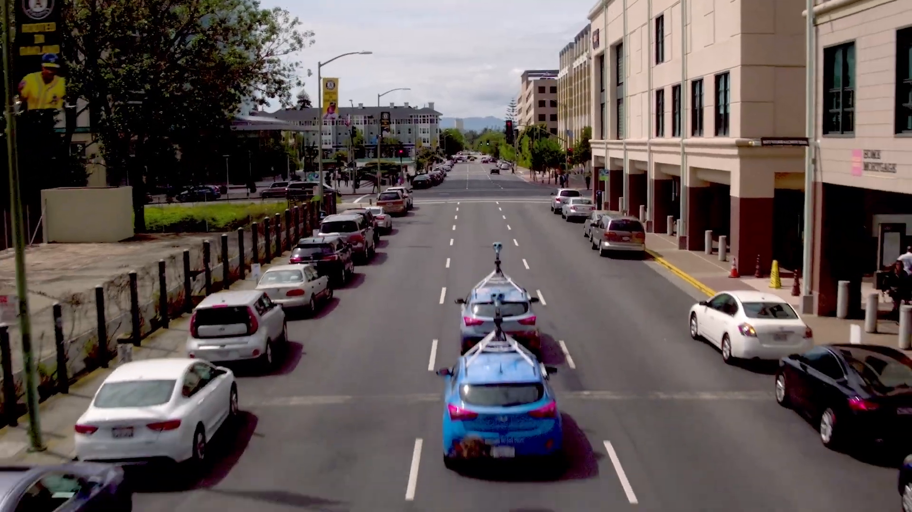

深度神经网络**识别**和**描述**图像中**可能在很长一段时间内被识别的那些部分**。

您可以看到该算法已经学会关注建筑物而不是汽车。

然后，我们将数百亿张图像中的这些显着点结合起来，计算出环境的 3D 点云。

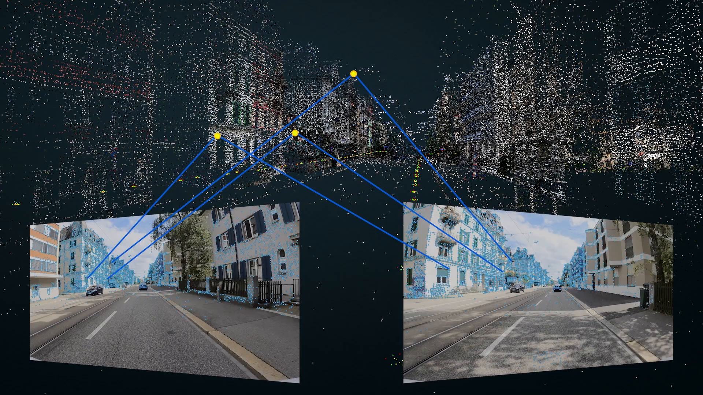

这种定位模型由**数万亿个点组成**，跨越几乎所有国家，未来覆盖范围广。

当您的设备向 Geospatial API 发出请求时，类似的过程将应用于图像。神经网络处理像素以找到环境中可识别的部分，并将它们与定位模型相匹配。然后，计算机视觉算法会计算发回给您的设备的位置和方向。

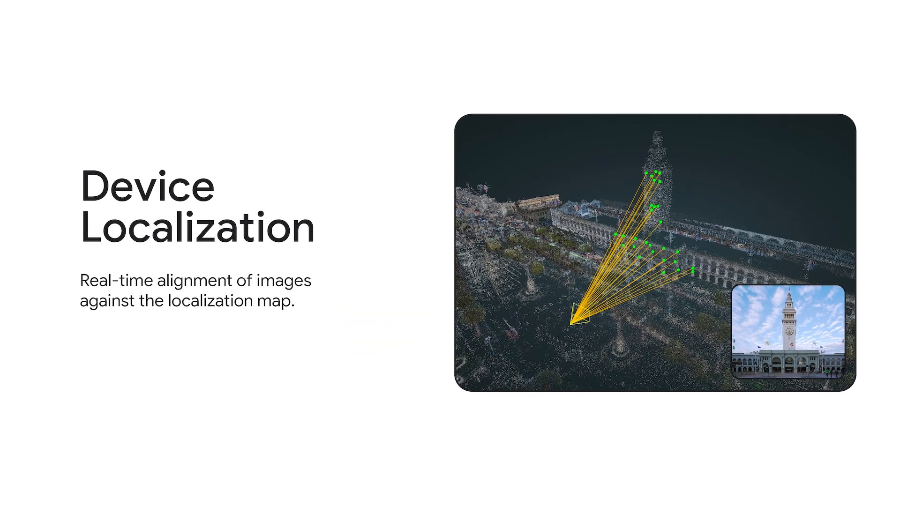

这个过程利用了TPU——谷歌的机器学习加速器——并且只需要**不到一秒钟的时间**。

使用来自 VPS 的响应，地理空间 API 负责将您的本地坐标与地理坐标合并，以便您可以在单个坐标系中工作。

正如比拉瓦尔之前提到的，这次启动提供了一种非常罕见的组合。Geospatial API 建立在非常成熟的视觉定位服务之上，我们将 API 提供给 Google Street View 覆盖的几乎所有领域，规模非常广泛。

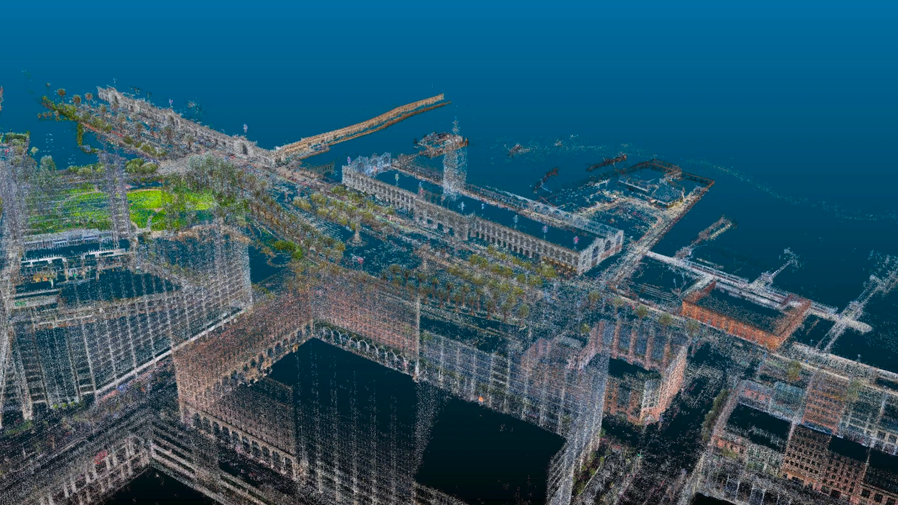

## 几何和锚定

构建 AR 体验时的一个关键挑战是内容与现实世界几何相关的准确位置。我们今天推出的 API 允许在**给定的纬度、经度和高度放置锚点**。

我们预计将在今年晚些时候推出地形锚点，这将允许您通过仅提供纬度和经度信息来创建锚点，同时利用来自 Google Mapsis 的其他信息将内容精确地放置在地面上的正确高度。右图显示了一个示例，其中**精确的高度信息**是令人愉悦的用户体验的关键。

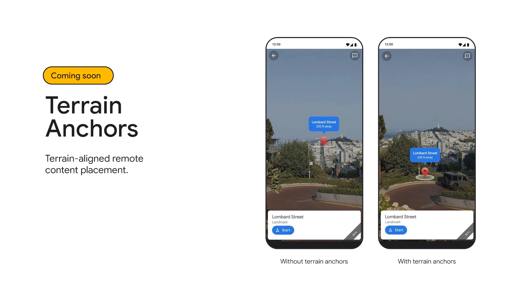

在下文中，我想向您展示团队目前正在开发的一项技术的幕后花絮。这些功能今天尚未发布，但我们正在探索使它们在未来可供开发人员使用的方法。当他们与现实世界无缝融合时，他们的体验变得真正神奇——例如，通过遮挡和物理转化为行动。

我们相信，一个关键的推动因素是抽象的建筑几何形状，如右图所示。

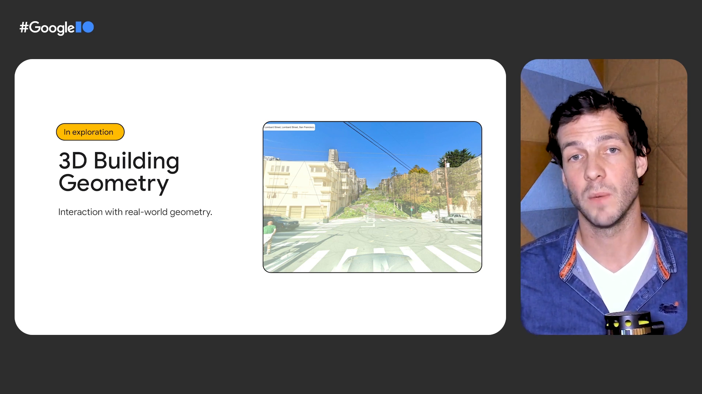

我们正在探索的另一个角度是将已经熟悉的 AR concepts 带到全球范围内。例如，ARCore 提供了将元素锚定到物理位置并将它们捕捉到设备检测到的平面几何图形的能力。对于地理空间 API，我们正在考虑一个类似的概念，我们称之为几何锚。它由两部分组成。

第一部分是捕捉和持久化，例如保持附着在墙上的锚点粘在墙上。
第二部分是关于保持锚点姿势，这样即使我们的模型随着时间的推移而改进，锚点也会**保留在您希望它们所在的位置**。

最后，我们希望****逐步公开更多我们底层的 3D 语义模型****，让您构建更丰富的体验。

特别是，结合现有的地理空间产品（例如 Google 地图平台），将语义理解添加到地理空间 API 将允许您按程序将内容放置在世界各地，例如公园或您最喜欢的咖啡店中的特定喷泉。

## 世界理解

我们正在考虑在未来几个季度制作语义 3D 模型的各个部分。

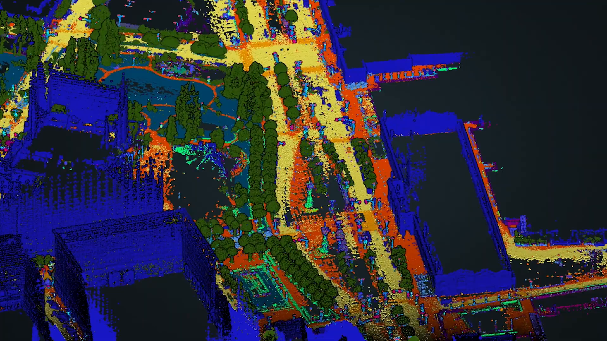

在未来的探索之后，让我们花点时间来看看我们今天推出了什么。

此代码示例向您展示了将您的 AR 体验带到全球范围是多么容易。

要获取地理空间数据，您需要通过将会话配置中的地理空间模式更改为已启用来启用地理空间 API。要确定远程锚点创建的锚点位置，您可以例如从 Google 地球或 Google 地图中采样点。然后，您可以开始使用这些坐标在全局框架中创建锚点。

我想展示的另一个示例是如何在应用程序中获取地理空间姿势。

地理空间姿势由纬度、经度和高度信息以及设备方向组成。所有这些数量都带有**估计的不确定性**。因此，您可以相应地调整您的体验。

您会看到，使用新的地理空间 API 构建全球规模的 AR 体验只需要几行额外的代码。

有了这个，我将返回 Bilawalto 向您介绍一些用例。

BILAWAL SIDHU： 谢谢，西蒙。

# 应用场景

我们已经看到开发人员对一系列用例和垂直领域的兴趣。

今天，我们将重点介绍三组应用程序。

## 拼车和微型交通

第一个垂直领域是拼车和微型交通。

两者都需要针对 GPS 无法解决的一系列用例进行高精度定位。

借助我们的新 API，合作伙伴正在消除停放无桩电动滑板车和电动自行车的摩擦，增加精确度，以便骑手知道他们的车辆何时处于有效停车位。结果是让骑手更加安心，在城市街道上更妥善地停放滑板车，从而与我们的合作伙伴所服务的社区建立更好的关系。相反，车辆发现变得更容易，特别是在密集的城市走廊中，定位精度更高，我们的合作伙伴正在使用它来帮助客户找到车辆，从而改善他们的用户体验并提高车辆租赁率。

## 基于位置的 AR 体验

下一个垂直领域是基于位置的 AR 体验。

借助我们的 API，开发人员可以专注于创建引人注目的用户体验，提供实用性和愉悦感，而无需构建和维护多个位置的地图。

Telstra 和 Accenture 正在为 Marvel Stadium 创建一个配套应用程序，将客户带到他们的座位上，同时展示引人入胜的、身临其境的内容。

DoCoMo 和 Curiosity 正在将东京热点变成一个身临其境的世界，您可以在其中与您最喜欢的机器人伴侣一起抵御虚拟龙。

## 游戏和自我表达

最后，我们有游戏和自我表达。

使用 Geospatial API，您可以将地球变成创意画布。

在 Balloon Pop 中，您可以将气球作为目标放置在现实世界中，并尝试使用启用了物理功能的球来弹出它们，该球会对世界空间中的距离作出反应。附近的用户可以通过简单的 Firebase 实现加入体验并弹出相同的气球。

借助 Pocket Garden，您可以用色彩缤纷的 AR 社区花园装饰您的社区，在现实世界中大规模精确地播种、种植葡萄藤、蓬松的多肉植物等。

我们还为 Snap 提供了对该 API 的早期访问权限，以帮助探索娱乐和教育用例。所有这些都是将地球变成画布时可能发生的事情的绝佳示例。

我们很高兴地分享 Balloon Pop 和 PocketGarden 将是开源的，可供您引导您自己的创造力。

我们期待看到开发人员使用 ARCore Geospatial API 构建什么。

总而言之，随着 GeospatialAPI 的引入，我们为构建全球规模的 AR 体验奠定了基础。

该 API 成熟且可投入生产，其底层技术已在 Google 规模上部署了三年多，并且有一系列合作伙伴在他们自己的经验中使用它。Geospatial API 现已在 Android 和 iOS 上所有支持 ARCore 的设备上可用。

开始使用我们的新地理空间代码实验室，或查看我们的 Android、Unity 和 iOS 示例以及 ARCore SDK。

当世界是你的画布时，我们很高兴看到你创造了什么。

